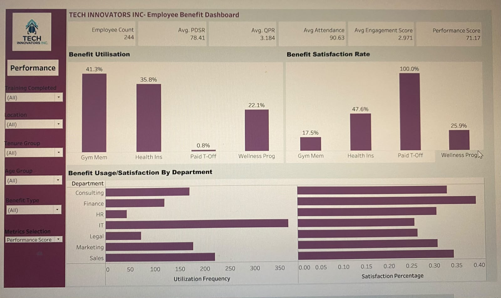
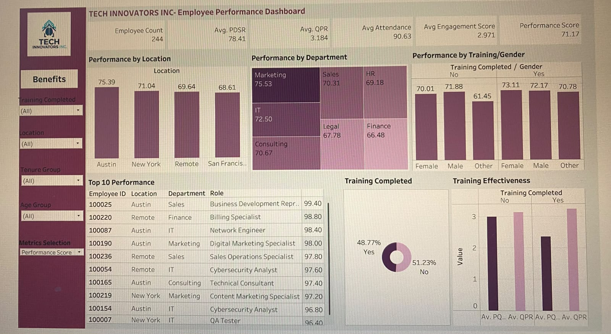

# Tech Innovators Inc – HR Analytics Project  
Employee Performance & Benefits Analysis using Tableau

This project analyzes employee performance, benefits utilization, and demographic trends for Tech Innovators Inc., a rapidly growing technology consulting firm. Using Tableau, the project provides HR managers with real-time insights to improve decision-making, optimize benefits, and strengthen talent development.

---

## 📊 Dashboards

### Employee Performance Dashboard  

### Employee Benefits Dashboard  

---

## 📌 Key Metrics
- Employee Count: 244  
- Average Performance Score: 71.17  
- Average Attendance: 90.63%  
- Top-performing location: Austin  
- Top-performing departments: Marketing, IT, Consulting  

---

## 💡 Key Insights
- Location and department strongly influence performance outcomes.  
- Training significantly improves quarterly performance.  
- Nearly half of employees have not completed training.  
- Benefit usage does not always correlate with satisfaction.  
- Paid Time Off is underutilized despite high satisfaction.  

---

## 🚀 Strategic Recommendations
- Replicate successful practices from high-performing teams.  
- Make training mandatory to improve performance.  
- Strengthen Gym Membership and Health Insurance programs.  
- Promote Paid Time Off to increase adoption.  
- Adopt department-specific benefits strategies.  

---

## 🔄 Project Workflow
1. Data Collection (Google Sheets)  
2. Data Cleaning & Preparation  
3. Exploratory Data Analysis  
4. Dashboard Development (Tableau)  
5. Testing & Publishing  
6. Executive Reporting  

---

## 🛠 Tools Used
- Google Sheets  
- Tableau  
- Excel  
